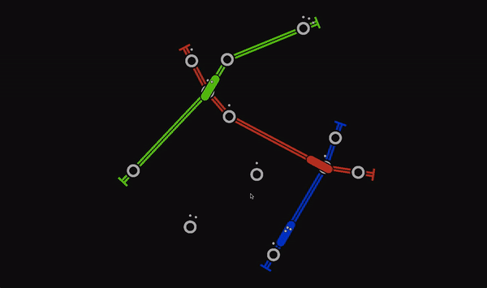

# Tubes

A collaborative game about metro construction.



## Setup & Build

This project can be built using [Stack](https://docs.haskellstack.org).

Before you build the project you need Stack to setup (install a compiler and update package indices):

```
stack setup
```

Then build the project and all the dependencies with a simple command

```
stack build
```

### OpenGL

On some systems you might see an error message like this:

```
Configuring OpenGLRaw-3.2.0.0...
setup-Simple-Cabal-1.24.0.0-ghc-8.0.1: Missing dependency on a foreign
library:
* Missing C library: GL
```

That means that you need to install OpenGL shared libraries and header files on your OS.

#### Ubuntu

To install OpenGL stuff on Ubuntu run this command:

```
sudo apt-get update
sudo apt-get install freeglut3 freeglut3-dev
```

## Launch & Play

This project consists of 3 executables:
- `tubes-exe` — a local single player game;
- `tubes-server` — a multiplayer game server;
- `tubes-client` — a `gloss`-based game client that connects to `tubes-server`.

### Single Player

Single player can be played alone or with bots.

```
stack exec tubes-exe
```

### Multiplayer

To play a multiplayer game first you need to launch the game server:

```
stack exec tubes-server
```

Then you can connect with multiple clients:

```
stack exec tubes-client
```

The client will connect to the game server and you'll be able to play immediately!
